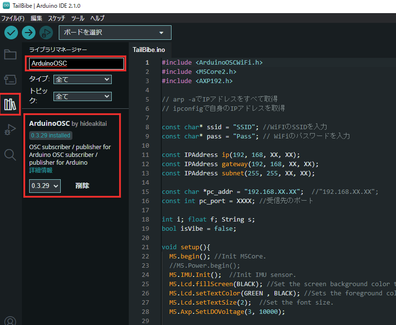
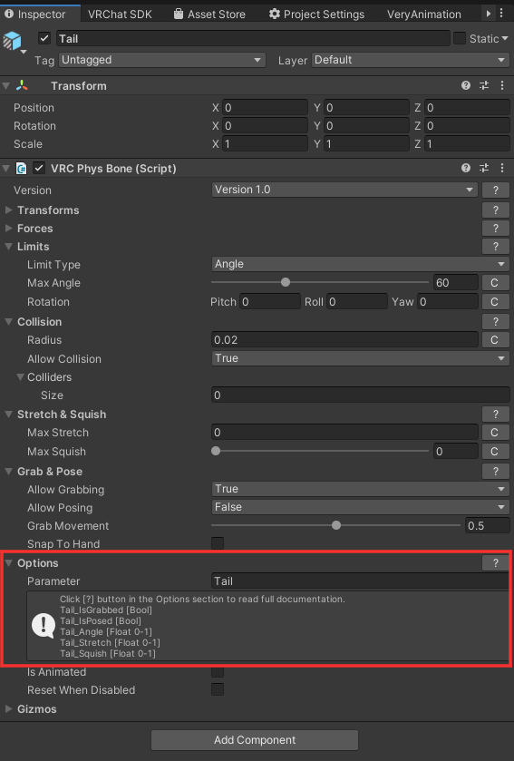
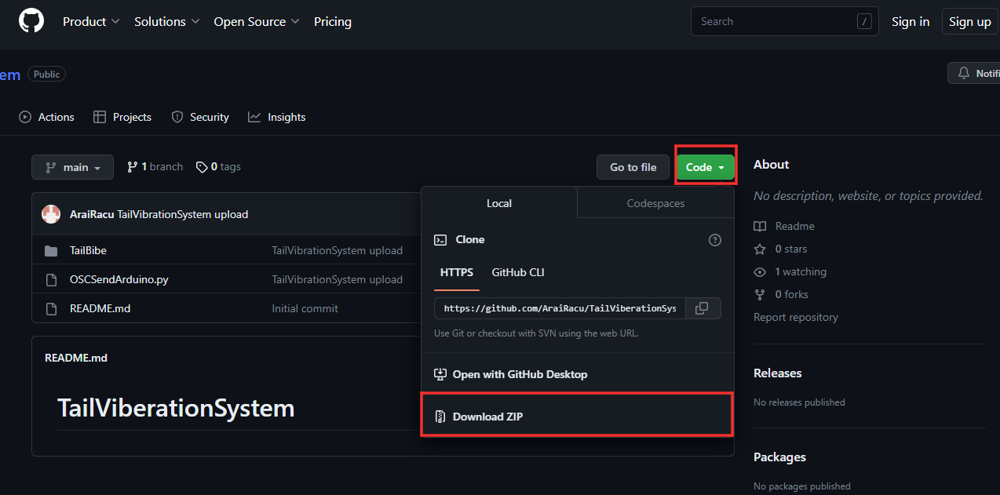
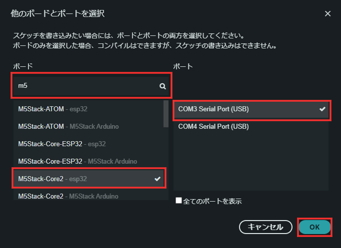
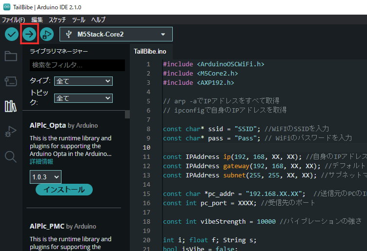

# TailViberationSystem

## 概要

VRChatのOSC通信機能を利用し，VRC内で尻尾を掴まれたら，腰に設置したM5Stackが振動することで，掴まれていることを気づけるハプティックデバイスです．

VRChatのOSC通信はローカルPC上のPythonで受け取り，ArduinoへOSC通信を行う2段構成になっています．

今回の導入方法ではM5Stack Core2をベースに説明します．

## 導入方法

### 環境構築

1. ArduinoIDEの導入<br>
以下のURLを参照し，インストールしてください．<br>
https://users.soracom.io/ja-jp/guides/dev-boards/m5stack/development-environment/

2. Pythonの導入<br>
以下のURLを参照し，インストールしてください．<br>
https://www.javadrive.jp/python/install/index1.html

### ライブラリ追加

1. ArduinoOSCの導入<br>
M5StackでOSC通信ができるように"ArduinoOSC"を導入します．<br>
ArduinoIDEのライブラリマネージャーから"ArduinoOSC"を検索し，インストールしてください．<br>


1. python-oscの導入<br>
PythonでOSC通信ができるように"python-osc"を導入します．<br>
コマンドプロンプトを開き，以下のコマンドを入力します．<br>
`pip install python-osc`<br>
インストールが成功後，以下のコマンドを入力し，インストール済みのライブラリを表示します．<br>
その中に"python-osc"が含まれていれば成功です．<br>
`python -m pip freeze`<br>

参考：https://pypi.org/project/python-osc/

### VRChatアバター設定

1. Unityでの設定<br>
画像のように尻尾に追加したPhysBoneの"Option"に任意のパラメータを入力してください．<br>
`[ここで設定したパラメータ名]_IsGrabbed`が今回用いるパラメータになります．<br>
入力後，アバターをアップロードしてください．<br>
※デフォルトは"Tail"です．任意のパラメータ名にするとPythonのコードを書き換える必要があります．<br>
<br>


2. jsonファイルの追記<br>
PhysBoneで設定したパラメータがOSCとして送信されるように設定します．<br>
VRChatの一時フォルダを開きます．(一時フォルダを変更している場合は変更先を参照してください)<br>
`C:\Users\(ユーザ名)\AppData\LocalLow\VRChat\VRChat\OSC\(ユーザID)\Avatars\`<br>
この中から，適用したいアバターのjsonファイルを探し，テキストエディタで開きます．<br>
`(アバター名)_(アバターID).json`<br>
ファイルを開いたら，以下のコードを追記します．(`<!--ここから-->, <!--ここまで-->`は含めないでください)<br>
PhysBoneで設定したパラメータが"Tail"ではない場合，コード内の"Tail"を設定したパラメータ名に書き換えてください．<br>
追記後，保存して閉じてください．<br>
```json
{
  "id": "[アバターID]",
  "name": "[アバター名]",
  "parameters": [
    <!--ここから-->
    {
      "name": "Tail_Stretch",
      "input": {
        "address": "/avatar/parameters/Tail_Stretch",
        "type": "Float"
      },
      "output": {
        "address": "/avatar/parameters/Tail_Stretch",
        "type": "Float"
      }
    },
    {
      "name": "Tail_Angle",
      "input": {
        "address": "/avatar/parameters/Tail_Angle",
        "type": "Float"
      },
      "output": {
        "address": "/avatar/parameters/Tail_Angle",
        "type": "Float"
      }
    },
    {
      "name": "Tail_IsGrabbed",
      "input": {
        "address": "/avatar/parameters/Tail_IsGrabbed",
        "type": "Bool"
      },
      "output": {
        "address": "/avatar/parameters/Tail_IsGrabbed",
        "type": "Bool"
      }
    },
    <!--ここまで-->
    {
      "name": "VRCFaceBlendH",
      "input": {
        "address": "/avatar/parameters/VRCFaceBlendH",
        "type": "Float"
      },
      "output": {
        "address": "/avatar/parameters/VRCFaceBlendH",
        "type": "Float"
      }
    },
    ︙
```
参考：https://note.com/33linn/n/n2f60b5155ee3

### ソースコードのダウンロード

本システムのコードをダウンロードします．<br>
リポジトリをクローンするか，直接ダウンロードしてください．<br>
ダウンロード後，ファイルを任意の場所に開きます．



### Python側設定

OSCSendArduino.pyをテキストエディタで開きます．<br>
10行目以降のコードに対して，それぞれ，
- _M5Stack_IP : M5StackのIPアドレスを設定します．任意のアドレスを設定できますが，使用していないアドレスを使ってください．
- _M5Stack_Port : M5Stackのポート番号を設定します．番号は任意ですが，予約されている番号は利用しないほうが無難です．
- _VRC_Parametor : PhysBoneに設定したパラメータを記述します．デフォルトを使用するのであれば，変更は必要ありません．任意のパラメータ名にした場合は，`/avatar/parameters/[任意のパラメータ名]_IsGrabbed`と記入してください．

設定完了後は保存してください．
```Python
_M5Stack_IP = "192.168.XX.XX"
_M5Stack_Port = XX

_VRC_Parametor = "/avatar/parameters/Tail_IsGrabbed"
```

### M5Stack側設定

TailBibe.inoをArduinoIDEで開きます．<br>
書き込む対象を設定するために，左上の"ボードを選択"をクリックします．<br>
開いたポップアップに対して，今回使用するボード(今回はM5Stack Core2)とM5Stackが繋がっているUSBポートを選択します．



ボードの設定をし終えたら，コードの設定を入力します．<br>
8行目以降のコードに対して，それぞれ，
- ssid : WifiルータのSSIDを入力します．
- pass : Wifiルータのパスワードを入力します．
- ip : OSCSendArduino.pyで設定したIPアドレスを入力します．
- gateway : ネットワークのデフォルトゲートウェイを入力します．※
- subnet : ネットワークのサブネットマスクを入力します．※
- pc_addr : 送信元のPCのIPアドレスを入力します．※
- pc_port : OSCSendArduino.pyで設定したポート番号を入力します．
- vibeStrength : バイブレーションの強さを設定します．強すぎるとバイブレーションの寿命が短くなるので，5000ぐらいから調整するといいです．

設定し終えたら，一旦保存してください．<br>
※ネットワークの各パラメータはコマンドプロンプト上で`ipconfig`を入力すると一覧で表示されます． <br>
参考：https://youtm-log.com/setting/windows-setting/ipadress_check/

```C++
const char* ssid = "SSID"; //WiFIのSSIDを入力
const char* pass = "Pass"; // WiFiのパスワードを入力

const IPAddress ip(192, 168, XX, XX); //自身のIPアドレス
const IPAddress gateway(192, 168, XX, XX); //デフォルトゲートウェイ
const IPAddress subnet(255, 255, XX, XX); //サブネットマスク

const char *pc_addr = "192.168.XX.XX";  //送信元のPCのIPアドレス
const int pc_port = XXXX; //受信先のポート

const int vibeStrength = 10000 //バイブレーションの強さ
```

保存後，左上の書き込みボタンを押し，M5Stackに書き込んでください．<br>
ArduinoIDEのコンソール画面に以下のようなログが表示されれば書き込み完了です．<br>
しばらくして，M5Stackの画面に`.?  [IPアドレス]`が表示されれば書き込み成功です．<br>
この状態になれば，M5StackはUSBを抜いても問題ありません．<br>


```
Writing at 0x000dc5db... (94 %)
Writing at 0x000e1b2f... (97 %)
Writing at 0x000e734c... (100 %)
Wrote 894880 bytes (566332 compressed) at 0x00010000 in 8.7 seconds (effective 824.9 kbit/s)...
Hash of data verified.

Leaving...
Hard resetting via RTS pin...
```


## 起動方法

M5Stackが起動状態(画面に`.?  [IPアドレス]`が表示されている状態)で<br>
PC上でOSCSendArduino.pyをダブルクリックし，起動してください．<br>
この状態で，VRChat内で尻尾を掴まれるとM5Stackが振動します．<br>